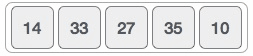

# Bubble Sort
Bubble sort is a simple sorting algorithm. This sorting algorithm is comparison-based algorithm in which each pair of adjacent elements is compared and the elements are swapped if they are not in order.
This algorithm is not suitable for large data sets as its average and worst case complexity are of Ο(n^2) where n is the number of items.

### Algorithm

###### Algorithm Generalised

We assume list is an array of n elements. We further assume that swap function swaps the values of the given array elements.

    begin BubbleSort(list)

        for all elements of list
	        if list[i] > list[i+1]
		        swap(list[i], list[i+1])
	        end if
        end for

        return list

    end BubbleSort

###### Time Complexity
    Worst-case performance	-- O(n^2)
    Average performance	   -- O(log n)

### Sources
This algorithm and its content is taken from [TutorialsPoint](https://www.tutorialspoint.com/data_structures_algorithms/bubble_sort_algorithm.htm) and [Wikipedia](https://en.wikipedia.org/wiki/Bubble_sort).
